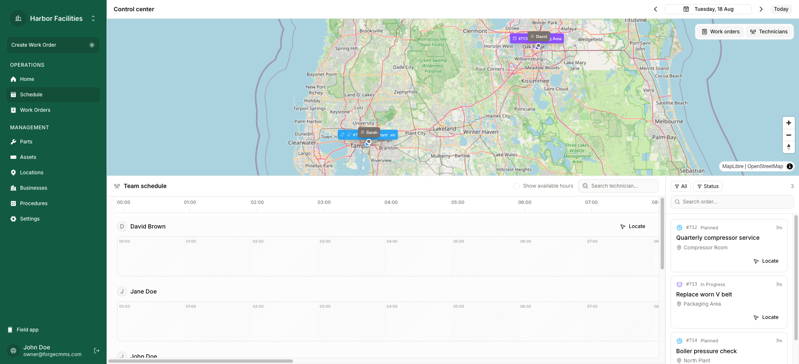
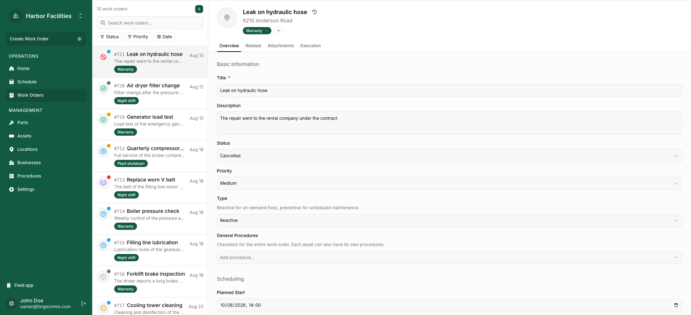
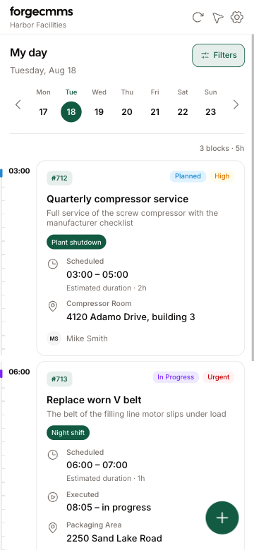

<div align="center">

# forgecmms

**Self-hosted maintenance management (CMMS).**
Work orders, assets, spare parts, locations and inspection procedures, in one
application that you run on your own server.

[](LICENSE)
[](https://www.typescriptlang.org/)
[](https://react.dev/)
[](https://tanstack.com/start)
[](https://www.postgresql.org/)
[](https://docs.docker.com/compose/)
[](https://web.dev/progressive-web-apps/)



</div>

## Features

- **Work orders**: reactive and preventive, recurrence, assignees, parts, assets,
  attachments, and an automatic PDF report when you close them
- **Assets**: hierarchy, location, status and criticality
- **Spare parts**: stock and minimum level. A work order decreases the stock
- **Locations**: address, coordinates and map. MapLibre with OpenStreetMap, no key
- **Procedures**: builder with 19 field types, validation and conditional logic.
  Technicians fill them on the phone, with signature and photos
- **Schedule**: dispatch board for the planner, day agenda for the technician
- **Field tools**: installable PWA, work-order stopwatch, optional GPS tracking
- **Multi-tenant**: organizations, invitations, member access and change log
- English, Spanish and Portuguese

<table>
<tr>
<td width="70%"></td>
<td width="30%"></td>
</tr>
<tr>
<td align="center"><b>Work orders</b></td>
<td align="center"><b>The technician day, on the phone</b></td>
</tr>
</table>

## Quick start

```bash
git clone git@github.com:luishiguera/forgecmms.git
cd forgecmms
cp .env.example .env
make up
```

## Development

```bash
make services
pnpm install
pnpm db:seed
pnpm dev
pnpm worker
```

`make services` publishes Postgres and MinIO on `127.0.0.1`. `make up` does not.

| Command | Purpose |
|---|---|
| `make services` | Postgres and MinIO on `127.0.0.1`, for development |
| `make up` | Build and start the whole stack |
| `pnpm dev` | Development server on port 3000 |
| `pnpm worker` | Job consumer for the PDF reports |
| `pnpm test` | Tests against a real database, on the demo data set |
| `pnpm check` | Lint and format |
| `pnpm db:generate` | Make a migration from the schema |
| `pnpm db:migrate` | Apply the migrations |
| `pnpm db:seed` | Empty every table and write the demo data set |

## Uninstall

```bash
make uninstall
```

Containers, volumes, network and images. The data goes with them.

## Stack

One full-stack TypeScript application. Phones install the same application as a PWA.

| Area | Choice |
|---|---|
| Runtime | React 19, Vite 8, TanStack Start on Node |
| Routing | TanStack Router, file-based |
| API | Typed RPC with server functions and Zod |
| Database | PostgreSQL with Drizzle ORM |
| Jobs | pg-boss, in the same database |
| Files | Plain S3 API against MinIO. Any S3 provider works |
| UI | Tailwind CSS 4, Base UI, shadcn, Phosphor icons |
| Maps | MapLibre with OpenStreetMap tiles |
| PDF | @react-pdf/renderer and sharp |
| i18n | Paraglide |
| Tests | Vitest |

## License

Apache License 2.0. See [LICENSE](LICENSE).
